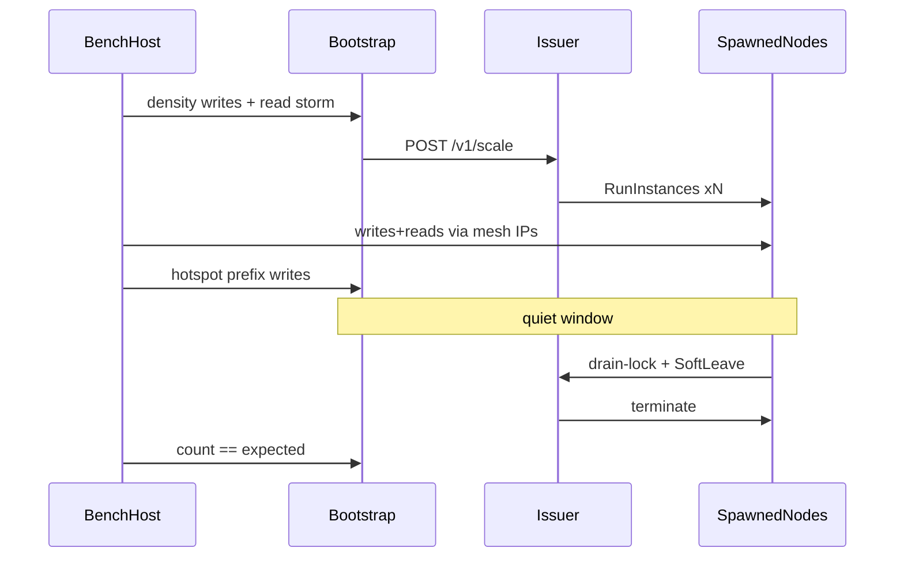

# DEFERRED — AWS lifecycle battle

> Saved aside until the core+aws monorepo merge is done. Paths below assume deploy/scripts live in this repo.

# Campagne AWS : lifecycle, hotspots, consistance

## Choix retenus

- **Pas de Lambda pour cette campagne.** Le fan-out existe déjà via Node (`geo_load_density.js`, `write_load.js`, `read_storm_http.js`) avec concurrence élevée. Les Lambdas n’apportent du parallélisme cloud que si le poste client sature ; on le mesurera (rps / 503) et on ne les introduira qu’en follow-up.
- **Cible mesh :** 1 bootstrap + jusqu’à 9 spawned (`spawn_max=9` dans [`deploy/terraform/terraform.tfvars`](deploy/terraform/terraform.tfvars)) → **10 nœuds**.
- **Compte / région :** chaîne de credentials default, `eu-west-3`, projet `indexus-aws`.
- **Volume cible :** ~100k inserts density-weighted + phase hotspot ~20k sur un préfixe étroit, lectures en parallèle pendant toute la montée.



## Phase 0 — Déployer le code actuel

1. Depuis le monorepo(../go-indexus-core (AWS deploy path)) : `./deploy/scripts/deploy.sh` pour pousser les binaires (post-refactor slog / SoftLeave / checkKey) et appliquer TF si besoin.
2. Vérifier `GET :19000/health` + `/status` sur le bootstrap ; issuer `:22000/health`.
3. Nettoyer les spawned zombies (déjà fait par [`downscale_battle.sh`](scripts/bench/downscale_battle.sh)).

## Phase 1 — Orchestrateur unique `lifecycle_battle.sh`

Créer [`scripts/bench/lifecycle_battle.sh`](scripts/bench/lifecycle_battle.sh) qui enchaîne (au lieu de relancer 3 labs séparés) :

| Étape | Action | Artefacts / assert |
|-------|--------|--------------------|
| A baseline | snap `/status`, `/autoscale`, `/registered`, EC2 spawned | `baseline.*` |
| B volume | `geo_load_density.js` COUNT≈100000, CONCURRENCY≈48, DURATION≈1200s | `geo_write.json` |
| C reads | `read_storm_http.js` en parallèle (clients 24, intervalle 10s) pendant B | `read_during_*.json` |
| D upscale | attendre `spawned == 9` (ou TARGET−1), timeout 20 min | `peak.spawned.json` |
| E hotspot | nouveau writer : inserts massifs sur **un préfixe** de location (ex. même 4 premiers chars) pour saturer une zone XOR | `hotspot_write.json` + metrics `/autoscale` |
| F settle | pause writes 60–90s, sum `/count` + `count_collection.js` | `count_peak.json` ; `got == expected` |
| G downscale | quiet → SoftLeave auto ; attendre spawned=0 | `post_down.spawned.json` |
| H consist | re-count HTTP tree + sum `/count` ; ownership via `mesh_snapshot.js` | `SUMMARY.json` pass/fail |
| I metrics | journaler latences read, taux 503/Retry-After, `inserts_window`, queue, peers, zones par nœud | `metrics.csv` |

Réutiliser les helpers déjà dans [`elasticity_10_lab.sh`](scripts/bench/elasticity_10_lab.sh) (`snap`, `mesh_nodes`, `count_items`) et la logique SoftLeave de [`downscale_battle.sh`](scripts/bench/downscale_battle.sh).

## Phase 2 — Hotspot writer

Ajouter [`scripts/bench/hotspot_load.js`](scripts/bench/hotspot_load.js) :

- Génère des locations **sous un préfixe fixe** (SDK `Space` / truncation BASE64) pour concentrer ownership + cache path-fill sur 1–2 nœuds.
- Même contrat auth/issuer que `write_load.js` ; root=`@`, current=location ; metrics largeur 5.
- Sortie JSON : accepted / 503 / rps / prefix.

Ça couvre « pic sur des clés » sans Lambda.

## Phase 3 — Consistance (contrat de pass)

À chaque jalon (post-volume, post-hotspot, post-downscale) :

1. **Comptage global** : `count_collection.js --expected N` (walk `/set` depuis `@`) **et** somme des `GET :19000/count` sur bootstrap + spawned.
2. **Pas de perte** : `final_total == COUNT + HOTSPOT_COUNT` après SoftLeave à 0 spawned.
3. **Santé mesh** : tous `/health` = 200 (sauf leave en cours = 503 temporaire) ; `/status.queue` → 0 après settle ; peers ≥ mesh size − 1.
4. **Élasticité** : `peak_spawned ≥ SPAWN_TARGET` ; `final_spawned == 0` ; durée upscale/downscale loggée.
5. **Hotspot** : ownership du préfixe visible sur peu de nœuds (`/ownership` snap) ; lectures root depuis n’importe quel peer renvoient le même agrégat count.

Fail → `SUMMARY.json` avec `pass:false` + phase + deltas ; ne pas masquer.

## Phase 4 — Exécution AWS

Ordre concret :

```bash
cd go-indexus-core (AWS deploy path)
./deploy/scripts/deploy.sh
cd scripts/bench
COUNT=100000 HOTSPOT=20000 TARGET_NODES=10 CONCURRENCY=48 \
  ./lifecycle_battle.sh
```

Durée estimée : 45–90 min (cooldown downscale + SoftLeave sérialisé). Artefacts sous `scripts/bench/out/lifecycle-*`.

Si le client local plafonne (&lt; quelques k inserts/s ou 503 saturés côté WAN) : lancer **2–3 processus** `geo_load_density.js` / `hotspot_load.js` en parallèle (même collection, ids disjoints) depuis le bench host — toujours sans Lambda.

## Phase 5 — Compte-rendu

Après la run : lire `SUMMARY.json`, comparer aux labs antérieurs (`elasticity10-*`, `downscale-battle-*`), et lister bugs éventuels (perte, livelock SoftLeave, ownership overlap, panics). Corriger seulement si la campagne expose une régression claire (comme lors du smoke local).

## Hors scope (follow-up explicite)

- Terraform Lambda / API Gateway pour fan-out cloud.
- Monter `instance_type` au-delà de `t3.micro` sauf si OOM / CPU saturé constaté.
- Monorepo core+aws.